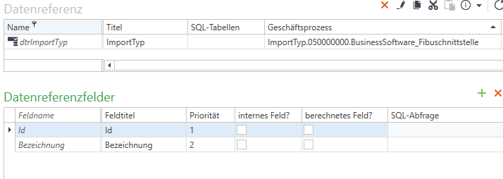

<!-- <!-- markdownlint-disable -->

<!-- TOC tocDepth:2..3 chapterDepth:2..6 -->

- [Erzeugen einer Auswahlfeldes mittels Geschäftsprozess](#erzeugen-einer-auswahlfeldes-mittels-geschäftsprozess)
- [Add current user to docker group](#add-current-user-to-docker-group)
- [List running containers](#list-running-containers)
- [List all started containers](#list-all-started-containers)
- [Docker run](#docker-run)
- [Docker delete containers](#docker-delete-containers)
- [Docker logs - get record of container outputs](#docker-logs---get-record-of-container-outputs)
- [Docker stop container](#docker-stop-container)
- [Docker exec -it](#docker-exec--it)
- [Tag images](#tag-images)

<!-- /TOC -->

<br>
<br>
<br>


### Erzeugen einer Auswahlfeldes mittels Geschäftsprozess 
Befüllen einer ComboBox mit Werten aus einer Enumeration mit einem Geschäftsprozess.

1. Anlegen einse Geschäftsprozesses im AppDesigner
2. Anlegen einer Datenreferenz im AppDesigner
3. Verknüpfen des Geschäftsprozesses mit der Datenreferenz
   


``` c#
systemctl --user start docker-desktop
```

### Add current user to docker group
``` bash
sudo usermod -aG docker $user
```

### List running containers
``` bash
docker ps
```

### List all started containers
``` bash
docker ps --all
```

### Docker run
``` bash
docker create  <name>
docker start <id>
docker start -a <id>
```

### Docker delete containers
``` bash
docker system prune
```

### Docker logs - get record of container outputs
``` bash
docker logs <id>
```

### Docker stop container

``` bash
docker stop <id> -> sigterm gracefully shutdown (kill after 10 secs)
docker kill <id> -> sigkill stops immediatly
```

### Docker exec -it
execute additional command in a container
``` bash
-i directs input in std in
-t format stuff
```

### Tag images
``` bash
[docker id]/[project]:latest
docker build -t alauhard/redis:latest .
```


